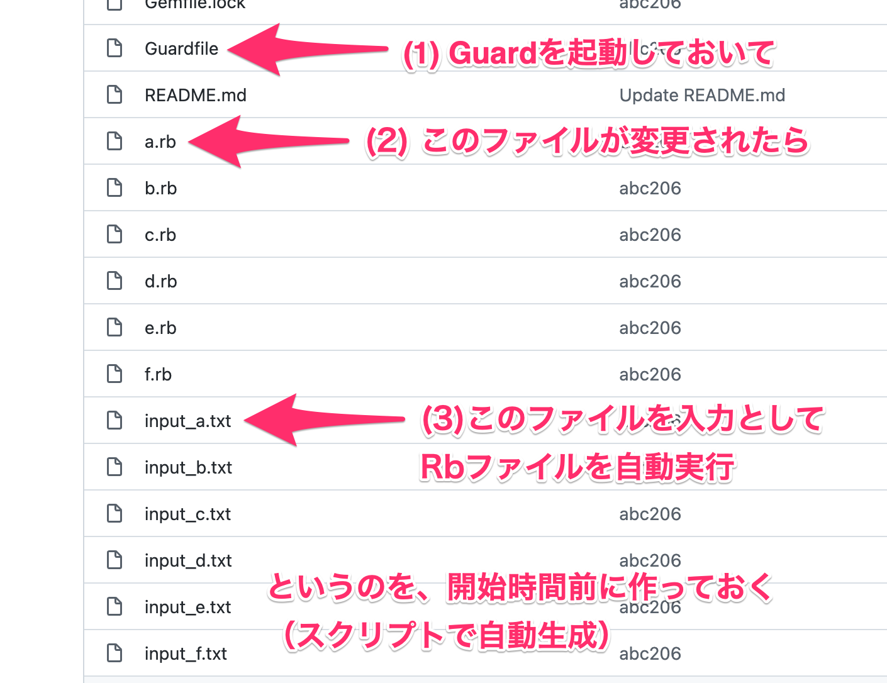
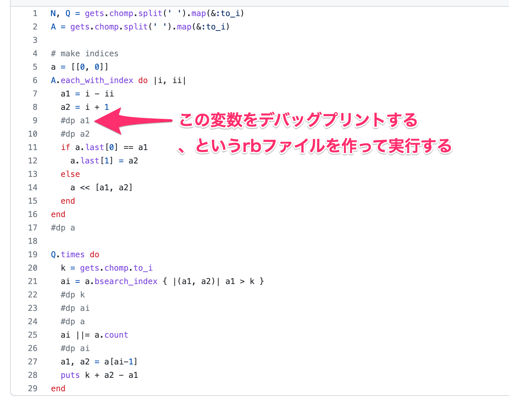

## プログラマにとっての「適度な運動」とは

2022/05/14 @Fukuoka.rb 256回 LT大会

黒木 慎介

---

## Fukuoka.rb 0x100回 おめでとうございます！！

---

## 自己紹介

- 1981年3月、福岡県北九州市生まれ（41歳）
- RubyとRails（など）で仕事してます
  - 2010-
  - 最近はTypeScript+Reactも書くようになった
- プログラミングを教える仕事も
  - 2019-
  - 大名エンジニアカレッジ 2021年度Webエンジニア基礎コースメンター

---

## 自己紹介

- 1981年3月、福岡県北九州市生まれ（41歳）
- . 
  - .
  - .
- .
  - .
  - 大名エンジニアカレッジ 2021年度Webエンジニア基礎コースメンター

---

# 41歳

---

## 41歳

- 言い逃れの余地なくおっさん
- プログラマ35歳定年説とかあった
  - 一応なんとかなっててありがたい
- 健康維持が大変

---

## 健康維持が大変

- 20代の頃と比べると…
  - 夜ふかしするときつい
  - 食べ過ぎるときつい
  - 変な姿勢で仕事してるときつい
  - などなど

---

## 健康維持が大変

色々調べても試行錯誤しても結局重要なのは

「適度な運動」

---

## 適度な運動

- 散歩（ドラクエウォーク）
- ランニング
- 自転車
- リングフィット

---

## 健康維持が大変（プログラマとして）

- 20代の頃と比べると…
  - 頭が回らなくなってきた気がする
    - 集中力、注意力、短期記憶
  - 新しい事を学習しづらくなった気がする
    - なまじ今までのスキルでも仕事できてしまうがばかりに
  - などなど

---

## 健康維持が大変（プログラマとして）

「適度な運動」？

---

## 適度な運動（プログラマとして）

コードを書く（そりゃそうだ）

---

## コードを書く

- 仕事でやってる時にはやりにくい寄り道ができる
  - 開発環境
  - 言語やフレームワークの新しい機能
  - 1つのリファクタリングの是非について1時間考えたって自由
  - これなんで動くの？みたいなのを掘り下げたって自由
- 自分が使うものを作るとモチベーションを維持しやすい
  - bot
  - 勤怠管理

---

## コードを書く、と言ってもさあ！

そんな都合よくお題見つからねえよ！！

---

# そんなあなたに！！

---

## プログラマにとっての「適度な運動」とは

2022/05/14 @Fukuoka.rb 256回 LT大会

黒木 慎介

---

## プログラマにとっての「適度な運動」としての競技プログラミング

2022/05/14 @Fukuoka.rb 256回 LT大会

黒木 慎介

---

## 競技プログラミング

- 問題が提供されるので「コード書きたいけど書きたいコードがない」状況が解消する
- 始めるしきいは思ってるのの10倍低い

---

## 誤解を解きたい

- 難しい
  - 難しい問題もあるけど、最初の問題は簡単で、1問くらいはだいたい解ける
- ガチらないといけない
  - 健康維持目的なら自分なりで良い
  - ランニングしよる人がみんなマラソン選手目指しとるわけじゃなかよね？
- 続けなきゃいけない
  - 確かに続けたほうがスコアは伸びる
  - でも私は作りたい物ができたタイミングでやめました

---

## AtCoder

- 競技プログラミング大手
- ここでやる前提で話します

---

## 必要なこと

- アカウント作成

---

## 問題を解いてみよう

https://atcoder.jp/contests/practice

---

## 概要

- 「こういう入力が与えられるので、こういう出力を返してください」
  - 計算、並び替え、探索、などなど
- 使うのは標準入力と標準出力
  - 知らない人は少し慣れは必要かも
- 毎週末にみんなが「いっせーの」で解いて、得点を競う
  - いつでも解ける問題も置いてある
- Rubyを含めて、だいたいどんな言語でも挑戦できる

---

## いいところ

- 自分のウデマエが数値化されるので燃える
  - 最初のうちは割とホイホイ上がるのでやる気が出る
- 工夫のしがいがある
- 安全に追い詰められることができる

---

## ウデマエ/得点

- 1回のコンテストでだいたい8問（100分）、難しいほど得点が高い
  - 私がやってた時は6問だった
- タイムも計測していて、同点なら早いほうが順位が高い
- 問題の難易度は揺れるので、自分のウデマエはレーティング（偏差値みたいなやつ）で計算される

---

## ウデマエ/レーティング

これで4000人中1000位とかそのへん

---

## 工夫/順位の決まり方

- 得点の高い人が上
- 同点なら解いた時間が短い人が上
- 提出して正解でなかった場合、解いた時間に5分ぶんのペナルティが加算
  - 実行した結果が正しくない
  - 制限時間（2秒とか）の間に実行結果を出せない

---

## 工夫/順位の決まり方

- .
- .
- 提出して正解でなかった場合、解いた時間に5分ぶんのペナルティが加算
  - 実行した結果が正しくない
  - 制限時間（2秒とか）の間に実行結果を出せない

---

## 工夫/最初から正しいコードを提出したい

- 手元で動作確認してから出せば良い
- そのための環境を作って置くと楽

---

## 工夫/私がやったこと

- 手元で動作確認してから出せば良い
- そのための環境を作って置くと楽

---

## 工夫/私がやったこと

---

## 工夫/なんで間違ってるのかわからん時

- デバッグしたい
- でも余計な出力をすると不正解になるので、提出時にはデバッグプリントしない必要がある
- そのための環境を作って置くと楽

---

## 工夫/私がやったこと

---

## 工夫/準備いらないんじゃないん？

- 必要なわけじゃない
- でもこういうのを考えるのも楽しい
- やりたくなったらやる、で良い

---

## 安全に追い詰められることができる

- 時間制限
- でも、間に合わなくても誰にも迷惑をかけない
- 仕事で追い詰められた時の訓練として

---

## おしまい

enjoy!